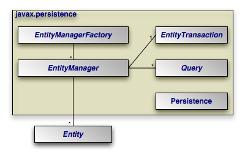

#Java Persistence Api
##Introduction
### Object/Relational Mapping
- A task to map a Java object with their attributes with relational database table and columns for all database task using object approach.

### Mismatches Between Relational and Object Models

Relational objects are represented in a tabular format, while object models are represented in an interconnected graph of object format. While storing and retrieving an object model from a relational database, some mismatch occurs due to the following reasons:

- Granularity : Sometimes Object model has more class needed than database table . Object model have more granularity than relational model.

- Subtypes : Inheritance paradigm are not supported by all types of relational databases. RDBMS usually normalize inheritance using additional type column, or additional related table with additional child specific columns.

- Identity : Like object model, relational model does not expose identity while writing equality. A RDBMS defines exactly one notion of 'sameness': the primary key. Java, however, defines both object identity a==b and object equality a.equals(b).

- Associations : Relational models cannot determine multiple relationships while looking into an object domain model.

- Data navigation : Data navigation between objects in an object network is different in both models.

### The Java Persistence API
Provide by Oracle, Java persistenece API is a collection of classes and methods to manage large amount of data persistenly in database.  

### JPA History
- Java Community Process(JSR) release Enterprise JavaBeans 3.0 
- JPA 1.0 as part of work of EJB 3.0 JSR 220 Expert group
- JPA 2.0 as part of work of JSR 317 Expert group
- JPA 2.1 as part of work of JSR 338 Expert group

### JPA Architecture
- Core classes and exceptions in package javax.persistence


- EntityManagerFactory  
  This is a factory class of EntityManager. It creates and manages multiple EntityManager instances.
- EntityManager  
  It is an Interface, it manages the persistence operations on objects. It works like factory for Query instance.
- Entity  
  Entities are the persistence objects, stores as records in the database.
- EntityTransaction  
  It has one-to-one relationship with EntityManager. For each EntityManager, operations are maintained by EntityTransaction class.
- Persistence  
  This class contain static methods to obtain EntityManagerFactory instance.
- Query  
  This interface is implemented by each JPA vendor to obtain relational objects that meet the criteria.
  
### Entity Metadata
#### Entities

* An entity is a lightweight persistence domain object.
* Typically an entity represents a table in a relational database, and each entity instance corresponds to a row in that table.
* The primary programming artifact of an entity is the entity class, although entities can use helper classes.

#### Requirements for Entity Classes

- The class must be annotated with the javax.persistence.Entity annotation.

- The class must have a public or protected, no-argument constructor. The class may have other constructors.

- The class must not be declared final. No methods or persistent instance variables must be declared final.

- If an entity instance be passed by value as a detached object, such as through a session bean’s remote business interface, the class must implement the Serializable interface.

- Entities may extend both entity and non-entity classes, and non-entity classes may extend entity classes.

- Persistent instance variables must be declared private, protected, or package-private, and can only be accessed directly by the entity class’s methods. Clients must access the entity’s state through accessor or business methods.

#### Persistent Fields and Properties in Entity Classes

- The persistent state of an entity can be accessed either through the entity’s instance variables or through JavaBeans-style properties. The fields or properties must be of the following Java language types:

- Java primitive types

- java.lang.String

- Other serializable types including:

	Wrappers of Java primitive types

	java.math.BigInteger

	java.math.BigDecimal

	java.util.Date

	java.util.Calendar

	java.sql.Date

	java.sql.Time

	java.sql.TimeStamp

	User-defined serializable types

	byte[]

	Byte[]

	char[]

	Character[]

- Enumerated types

- Other entities and/or collections of entities

- Embeddable classes


#### Persistent Fields
- If the entity class uses persistent fields, the Persistence runtime accesses entity class instance variables directly. All fields not annotated javax.persistence.Transient or not marked as Java transient will be persisted to the data store. The object/relational mapping annotations must be applied to the instance variables.

#### Persistent Properties

- If the entity uses persistent properties, the entity must follow the method conventions of JavaBeans components. JavaBeans-style properties use getter and setter methods that are typically named after the entity class’s instance variable names. For every persistent property property of type Type of the entity, there is a getter method getProperty and setter method setProperty. If the property is a boolean, you may use isProperty instead of getProperty. For example, if a Customer entity uses persistent properties, and has a private instance variable called firstName, the class defines a getFirstName and setFirstName method for retrieving and setting the state of the firstName instance variable.

- The method signature for single-valued persistent properties are as follows:

Type getProperty()
void setProperty(Type type)

- The object/relational mapping annotations for must be applied to the getter methods. Mapping annotations cannot be applied to fields or properties annotated @Transient or marked transient.

#### Using Collections in Entity Fields and Properties
- Collection-valued persistent fields and properties must use the supported Java collection interfaces regardless of whether the entity uses persistent fields or properties. The following collection interfaces may be used:

	java.util.Collection

	java.util.Set

	java.util.List

	java.util.Map

- If the entity class uses persistent fields, the type in the preceding method signatures must be one of these collection types. Generic variants of these collection types may also be used. For example, if it has a persistent property that contains a set of phone numbers, the Customer entity would have the following methods:

Set<PhoneNumber> getPhoneNumbers() { ... }
void setPhoneNumbers(Set<PhoneNumber>) { ... }

- If a field or property of an entity consists of a collection of basic types or embeddable classes, use the javax.persistence.ElementCollection annotation on the field or property.

- The two attributes of @ElementCollection are targetClass and fetch. The targetClass attribute specifies the class name of the basic or embeddable class and is optional if the field or property is defined using Java programming language generics. The optional fetch attribute is used to specify whether the collection should be retrieved lazily or eagerly, using the javax.persistence.FetchType constants of either LAZY or EAGER, respectively. By default, the collection will be fetched lazily.

- The following entity, Person, has a persistent field, nicknames, which is a collection of String classes that will be fetched eagerly. The targetClass element is not required, because it uses generics to define the field.

@Entity
public class Person {
    ...
    @ElementCollection(fetch=EAGER)
    protected Set<String> nickname = new HashSet();
    ...
}

### The Entity Manager
### JPA Providers

## Object/Relational Mapping
### Annotations
### JavaBean Standards
### Property, Field, and Mixed Access

- The persistence implementation must be able to retrieve and set the persistent state of your entities, mapped superclasses, and embeddable types. JPA offers two modes of persistent state access: field access, and property access. Under field access, the implementation injects state directly into your persistent fields, and retrieves changed state from your fields as well. To declare field access on an entity with XML metadata, set the access attribute of your entity XML element to FIELD. To use field access for an entity using annotation metadata, simply place your metadata and mapping annotations on your field declarations:

   ```java
@ManyToOne
private Company publisher;
```
- Property access, on the other hand, retrieves and loads state through JavaBean "getter" and "setter" methods. For a property p of type T, you must define the following getter method:

   ```java
T getP();
```
For boolean properties, this is also acceptable:
   ```java
boolean isP();
   ```
You must also define the following setter method:
   ```java
void setP(T value);
```
- To use property access, set your entity element's access attribute to PROPERTY, or place your metadata and mapping annotations on the getter method:

   ```java
@ManyToOne
private Company getPublisher() { ... }


private void setPublisher(Company publisher) { ... }
```

Warning

- When using property access, only the getter and setter method for a property should ever access the underlying persistent field directly. Other methods, including internal business methods in the persistent class, should go through the getter and setter methods when manipulating persistent state.

- Also, take care when adding business logic to your getter and setter methods. Consider that they are invoked by the persistence implementation to load and retrieve all persistent state; other side effects might not be desirable.

- Each class must use either field access or property access for all state; you cannot use both access types within the same class. Additionally, a subclass must use the same access type as its superclass.

- Mixed Access Mode

Though you will not require to mix modes in most of the scenarios, but it is possible and useful in some cases. For example, when an entity subclass is added to an existing hierarchy that uses a different access type. Adding an @Access annotation with a specified access mode on the subclass entity (or even field) will cause the default access type to be overridden for that entity subclass.

### Table and Column Mapping
### Primary Keys and Generation
- Primary key should be one of the Java primitive type
- Date primary key, temporal type should be spesified as DATE.
- Composite Primary Key Rules:
  * The primary key class must be public and must have a public no-arg constructor.
  * The access type (field- or property-based access) of a primary key class is determined by the access type of the entity for which it is the primary key unless the primary key is a embedded id and a different access type is specified. See Section 2.3, “Access Type”.
  * If property-based access is used, the properties of the primary key class must be public or protected.
  * The primary key class must be serializable.
  * The primary key class must define equals and hashCode methods. The semantics of value equality for these methods must be consistent with the database equality for the database types to which the key is mapped.
  * A composite primary key must either be represented and mapped as an embeddable class (see Section 11.1.17, “EmbeddedId Annotation”) or must be represented as an id class and mapped to multiple fields or properties of the entity class (see Section 11.1.22, “IdClass Annotation”).
  * If the composite primary key class is represented as an id class, the names of primary key fields or properties in the primary key class and those of the entity class to which the id class is mapped must correspond and their types must be the same.
  * A primary key that corresponds to a derived identity must conform to the rules of Section 2.4.1.
  
### Type Mappings
- Basic DataType to Java Type Mapping.  
   MS SQL Server: https://msdn.microsoft.com/en-us/library/ms378878(v=sql.110).aspx  
   ORACLE, PL/QL : https://docs.oracle.com/cd/B19306_01/java.102/b14188/datamap.htm
   
### Temporal and Enumerated Types
####Temporal Type  
When dealing with persistent field with java.util.Date or java.util.Calendar we need to convert to database compatible column type to store and retrieve from database. Temporal type have 3 enum value.  
- TemporalType.DATE (equal to java.sql.Date)  

  ```java
@Temporal(TemporalType.DATE)
@Column(name = "START_DATE")
private java.util.Date startDate;
```
- TemporalType.TIME (equal to java.sql.Time)  

  ```java
@Temporal(TemporalType.TIME)
@Column(name = "START_DATE")
private java.util.Date startDate;
```
- TemporalType.TIMESTAMP (equal to java.sql.TimeStamp)  

  ```java
@Temporal(TemporalType.TIMESTAMP)
@Column(name = "START_DATE")
private java.util.Date startDate;
```

#### Enumerated Types

### Embedded Types

### Entity Relationships
### -@ManyToOne Relationships
### -@OneToOne Relationships
### -@OneToMany Relationships
### -@ManyToMany Relationships
### -Eager and Lazy Loading

##Entity Managers
### Putting Entities to Work
### persistence.xml
### Entity State and Transitions
### Managing Transactions
### Persistence Operations
### Creating Queries
### Named Queries
### Query Parameters
### Native Queries

##JPQL
### The Java Persistence Query Language
### Query Structure
### Path Expressions
### Filtering
### Scalar Functions
### Operators and Precedence between, like, in, is null, is empty
### Ordering
### Aliases
### Grouping
### Aggregate Functions
### Joins
### Constructors

##Advanced Mapping
### Inheritance Strategies
### Single-Table Strategy
### Joined-Table Strategy
### Table-Per-Concrete-Class Strategy
### Querying Over Inheritance Relationships
### Secondary Tables
### Composite Primary Keys
### @IdClass and @EmbeddedId
### Derived Identifiers
### @ElementCollection
### Default Values
### @Version Fields
### Cascading and Orphan Removal
### Detachment and Merging

##The Criteria API
### History of the Criteria API
### Criteria Query Structure
### The MetaModel API and Query Type Safety
### Tuples
### Joins
### Predicates
### Building Expressions
### Ordering
### Grouping
### Encapsulating Persistence Logic
### Façades
### Range Queries


##Lifecycle and Validation
### Lifecycle Events
### Method Annotations
### Entity Listeners
### JSR-303 Validation
### Constraint Annotations
### Validation Modes
### Validation Groups

##Locking and Caching
### Concurrency
### Optimistic Locking
### Optimistic Read Locking
### Optimistic Write Locking
### Pessimistic Locking
### Caching
### Persistence Context as Transactional Cache
### Shared (2nd-level) Cache
### Locking and Caching "Do's and Don'ts"

## Judul
- list 1
- list 2


[‎4/‎22/‎2016 10:05 AM] Kustian: 
yup
contoh https://github.com/mitraisjavameetup/presentations 
